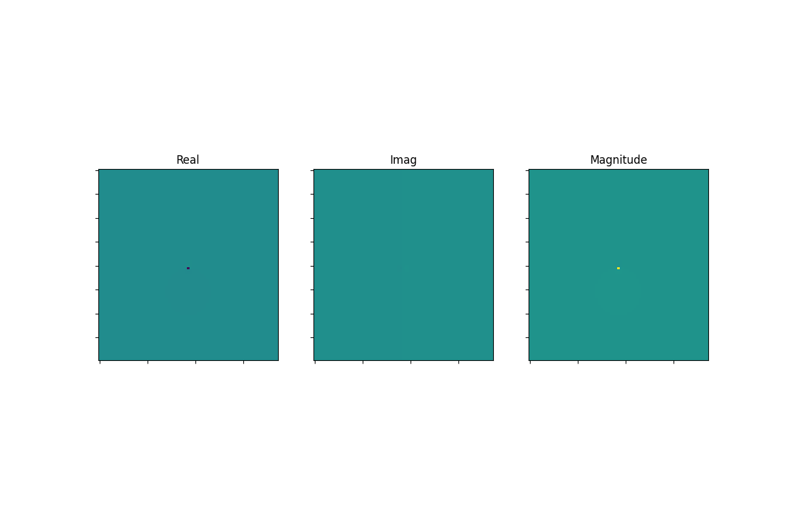

# Scientific Projects

A collection of Python projects covering scientific computing, numerical methods, probability, and data analysis.

## Projects

### Project 1: Möbius Transformation Animation

This project explores Möbius transformations using Python and visualizes how complex transformations evolve through animation. It demonstrates mathematical concepts using NumPy and Matplotlib.

**Topics covered**
- Complex numbers
- Möbius transformations
- Scientific visualization
- Matplotlib animations
- NumPy

> 📁 **Project files:** Visit the **`animations/`** folder to explore the notebook, source code, and other project files.

#### Demo

  

---

More projects will be added as this repository grows.
